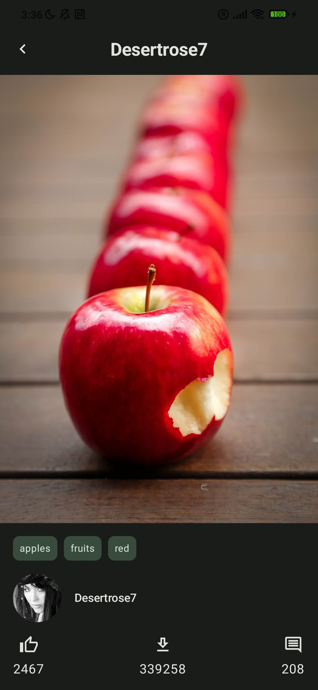

# Pixabay Image Explorer Task

Minimum API Level: 24

## Contents

- [Features](#features)
- [Design and Architecture](#design-and-architecture)
- [Utilized Libraries](#utilized-libraries)
- [Visual Gallery](#visual-gallery)
- [Things to improve](#things-to-improve)

## Features

Image Explorer facilitates the retrieval of images from Pixabay based on user queries.
It showcases these images in a list format. The app also includes Room DB for local caching.
A detailed view of the image is available in the Details view, triggered by a user's positive interaction with a dialog prompt.

## Design and Architecture

My app adopts the Modular Clean Architecture with MVI presentation architecture. This design approach ensures a clear separation of concerns and simplifies testing.
Presentation -> Domain <- Data

## Utilized Libraries

Key libraries in the application:

- [Jetpack](https://developer.android.com/jetpack) 🚀
    - [ViewModel](https://developer.android.com/topic/libraries/architecture/viewmodel)
    - [Room](https://developer.android.com/training/data-storage/room)
- [Retrofit](https://square.github.io/retrofit/)
- [OkHttp Logging Interceptor](https://github.com/square/okhttp/blob/master/okhttp-logging-interceptor/README.md)
- [Kotlin Coroutines](https://github.com/Kotlin/kotlinx.coroutines)
- [Hilt](https://developer.android.com/training/dependency-injection/hilt-android)
- [Koin](https://insert-koin.io/)

## Visual Gallery

## Things to improve
- Add tests
- Handle cancellation exception in ViewModel
- Add splash screen
- Add loading indicator (progress bar)